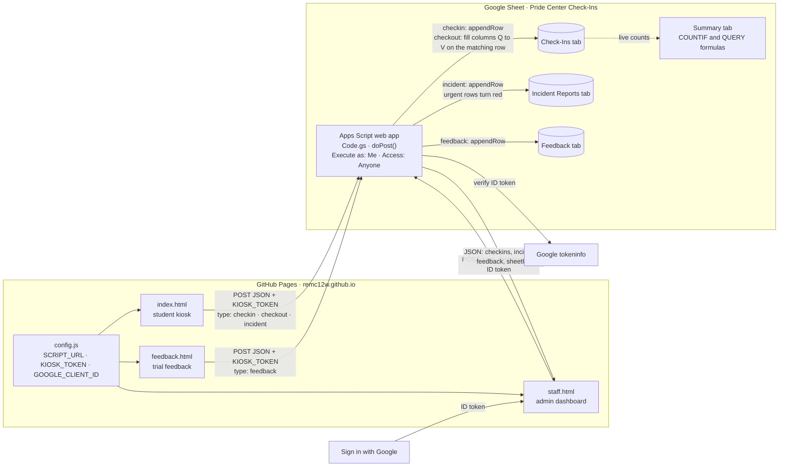
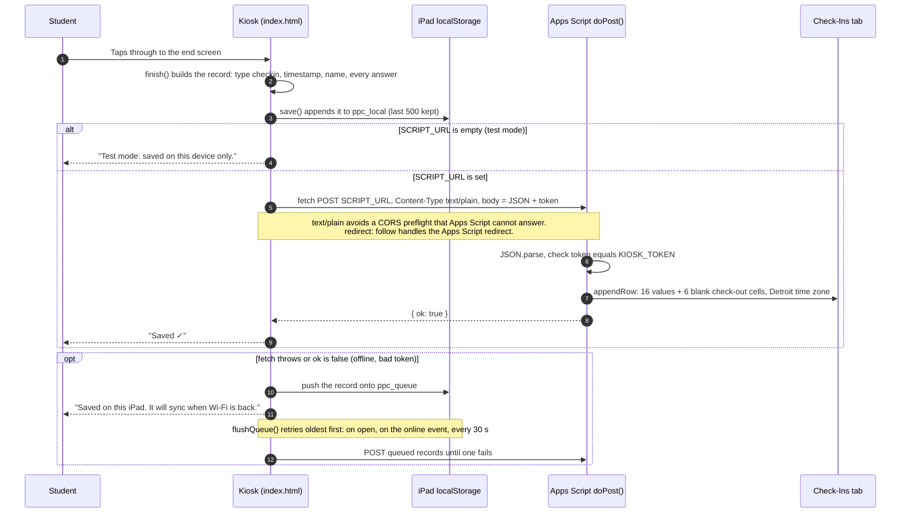
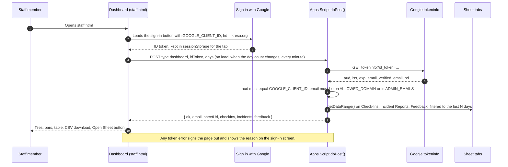

# Panther Pride Center – Student Check-In

A tap-through check-in kiosk for the Pride Center, rebuilt from the Google Slides deck so that every check-in is recorded in a Google Sheet and admins can see who came in, why, and how they were feeling.

- **Kiosk (live):** https://remc12w.github.io/panther-pride-checkin/
- **Google Sheet:** [Pride Center Check-Ins](https://docs.google.com/spreadsheets/d/1CefuY4Uq8CgEqR6PQteZO4W02puMwbYvrsCOxdRQIgw/edit)
- **Repo:** https://github.com/REMC12W/panther-pride-checkin (GitHub Pages serves the `master` branch)

**What's in here**

| File | What it is |
|---|---|
| `index.html` | The student kiosk. Open this on the iPad. |
| `staff.html` | Admin dashboard behind "Sign in with Google". In test mode, shows device-only data. |
| `config.js` | The only file you edit: script URLs, kiosk name, timers, basic-needs list. |
| `apps-script/Code.gs` | Backend that lives inside the Google Sheet. Verifies dashboard sign-ins. |
| `apps-script/appsscript.json` | Optional manifest (sets the Michigan time zone). |
| `feedback.html` | Trial feedback portal. Switch off with `FEEDBACK_ENABLED` in `config.js`. |
| `sw.js` | Service worker. Lets the kiosk open with no Wi-Fi and keeps files fresh when online. |
| `assets/` | Panther logo and app icons. |

## The flow

Matches the hyperlinks in the current PowerPoint deck.

1. Start → student types name or ID
2. Why are you here today? **Self Referred** (I have a need) or **Staff Referred** (a teacher sent me)
3. What do you need today? **Drop In: I need a reset**, **Scheduled Break**, or **I have a need… (medical, food, clothing)**
4. **I have a need** goes to: Incident Report or Basic Need. Incident Report opens a short in-app report that covers every question on the district "Student Incident Report" form: Are you safe right now? → Grade (6th/7th/8th) → What happened (multi-select from `INCIDENT_TYPES`) → Where (`INCIDENT_PLACES`, the district's list) → When (`INCIDENT_PERIODS`, the district's class hours) → Tell us what happened (own words, who was involved, witnesses) → Do you want to talk to someone today? The district form collects the student's Google email automatically; the kiosk can't, so the name typed at check-in is the identifier. A student who says they are not safe is routed to "a staff member is coming to you." Reports land in an **Incident Reports** tab in the Sheet with urgent rows highlighted, and in the admin dashboard. Basic Need opens "What do you need?" where the student taps one or more items from `BASIC_NEEDS` in `config.js`, then continues to the feelings questions below.
5. How is your body + brain feeling? (Fast / Slow / Ok)
6. Which group of words describes how you feel? Fast shows the red and yellow grids, Slow shows blue, Ok shows green. Student taps one word.
7. What happened? (Home / Teacher / Friend / Myself)
8. Station suggestion. The mood word's color picks a regulation station (Red, Yellow, Blue, Green). The app says "The blue station is set up for how you're feeling. Go there, or pick another," and records both the suggestion and the choice. Words in `STAFF_FIRST_WORDS` (enraged, hopeless, and so on) skip the picker and show "A staff member is coming to you" instead.
9. End screen with the deck's CLICK HERE button: Incident Report opens the incident form, Check In and Basic Need open the sign-in form. Both need a KRESA Google login, exactly as before. Clear `FORM_INCIDENT_URL` or `FORM_SIGNIN_URL` in `config.js` to hide a button. The app resets for the next student after 30 seconds.

**Check-out.** The start screen has a "Leaving? Tap here to check out" link. The student types their name, answers the body + brain question and the word grid again, then taps what helped (from `WHAT_HELPED` in `config.js`). The Sheet fills in the check-out columns on that student's check-in row: check-out time, minutes in room, mood at check-out, and what helped. The end screen tells the student "You came in Blue and you're leaving Green."

Every check-in is saved the moment the end screen appears. If Wi-Fi drops, it's kept on the iPad and synced automatically when the connection returns. If a student walks away mid-flow, the app returns to the start after two minutes so nobody sees their answers.

## How it connects to the Google Sheet

Nothing in this repo calls the Google Sheets API directly. The bridge is the Apps Script web app that lives inside the Sheet: the pages on GitHub Pages POST JSON to the script's URL, and the script writes the rows. Until `SCRIPT_URL` in `config.js` is filled in (Setup step 4), the kiosk runs in test mode and nothing reaches the Sheet.

### The pieces



Setup wires this together in order: paste `Code.gs` into the Sheet (step 2), run `setup` to build the tabs (step 3), deploy as a web app and paste its URL into `config.js` (step 4), create the OAuth Client ID for the dashboard (step 5), then push so GitHub Pages serves the new config (step 6).

### One check-in, step by step



Check-out, incident, and feedback records travel the same road. The differences are on the Sheet side: a check-out does not add a row but finds the same name checked in within 6 hours with no check-out yet and fills columns Q to V of that row (or adds a "no check-in found" row), an incident goes to the Incident Reports tab (created on first use, urgent rows highlighted), and feedback goes to the Feedback tab.

### Dashboard read path



The Summary tab needs none of this. It is COUNTIF and QUERY formulas pointing at the Check-Ins tab, so it updates the moment a row lands.

## Setup (about 15 minutes, one time)

### 1. Open the Google Sheet

The sheet already exists: [Pride Center Check-Ins](https://docs.google.com/spreadsheets/d/1CefuY4Uq8CgEqR6PQteZO4W02puMwbYvrsCOxdRQIgw/edit). It's empty until the script builds the tabs.

### 2. Add the script

1. In the Sheet, go to **Extensions → Apps Script**.
2. Delete the sample code in `Code.gs` and paste in everything from `apps-script/Code.gs`.
3. Optional: to limit the dashboard to specific people, add their emails to `ADMIN_EMAILS` near the top. Otherwise anyone with a kresa.org account can open it.
4. `KIOSK_TOKEN` must match `config.js`. They already match in this repo.
5. Click **Save**.

### 3. Run setup once

1. In the function dropdown next to the Run button, pick **setup**, then click **Run**.
2. Google asks you to authorize. Choose your account, click **Advanced → Go to (project name)**, then **Allow**. This is normal for a script you wrote yourself.
3. Back in the Sheet you now have a **Check-Ins** tab with headers and a **Summary** tab with live counts. Incident Reports and Feedback tabs appear on their first entry.

Optional: run **testInsert** the same way to add a fake row and confirm it works. Delete that row afterward.

### 4. Deploy the script (once)

1. **Deploy → New deployment**. Click the gear next to "Select type" → **Web app**.
2. **Execute as: Me**. **Who has access: Anyone**.
3. **Deploy**, then copy the Web app URL into `config.js`:

```js
SCRIPT_URL: "https://script.google.com/macros/s/AKfy.../exec",
```

"Anyone" lets the iPad post without a login. Nobody can read data through this URL without a verified Google sign-in (step 5). Opening it in a browser shows a plain notice page.

### 5. Set up "Sign in with Google" for the dashboard

The dashboard at `staff.html` uses Google's own sign-in. You need one OAuth Client ID, which takes about five minutes:

1. Go to https://console.cloud.google.com/ with your kresa.org account. Create a project (any name, for example "Pride Center").
2. **APIs & Services → OAuth consent screen**. User type **Internal** (only district accounts can sign in). Fill in the app name and your email, save.
3. **APIs & Services → Credentials → Create credentials → OAuth client ID**. Application type **Web application**.
4. Under **Authorized JavaScript origins** add `https://remc12w.github.io`. For local testing also add `http://localhost:8765`.
5. **Create**, then copy the Client ID (it ends in `.apps.googleusercontent.com`).
6. Paste it into **both** places:
   - `config.js` → `GOOGLE_CLIENT_ID`
   - `Code.gs` → `GOOGLE_CLIENT_ID`, then **Deploy → Manage deployments → pencil → New version → Deploy**.

If Cloud Console is locked down in your district, ask your Google Workspace admin to create the Web application client with that origin, or to allow you to. Nothing else in the setup needs the console.

How it works: the sign-in button gives the browser a Google ID token. `staff.html` sends it with every data request, and `Code.gs` verifies it with Google, checks the domain (and `ADMIN_EMAILS` if set), and only then returns data. Tokens expire after an hour, at which point the page asks you to sign in again.

### 6. Publish the config

```bash
git add -A && git commit -m "Connect the Google Sheet" && git push
```

GitHub Pages updates in about a minute. The yellow "test mode" banner disappears from the kiosk, and `staff.html` shows the sign-in page.

**If you later edit Code.gs**, publish a new version: **Deploy → Manage deployments → pencil icon → Version: New version → Deploy**. The URL stays the same.

### 7. Set up the iPad

1. Open the kiosk URL in Safari.
2. Tap **Share → Add to Home Screen**. It becomes a full-screen app with the panther icon.
3. To lock the iPad to the app, enable **Settings → Accessibility → Guided Access**, open the app, then triple-click the top button.

## Admin dashboard

Open `staff.html` and sign in with a district Google account. You get:

- Tiles: check-ins, unique students, and counts by outcome
- Bars: referral, reason, energy, mood group, what happened, top feelings, basic needs requested, station, mood at check-out, what helped
- Tiles for checked-out count and average minutes in room
- A table of every check-in in the selected range
- CSV download of the current view, a link to the Sheet, and auto-refresh every minute

Ranges: Today, Yesterday, This week, or everything loaded (14 to 365 days).

The **Summary** tab in the Sheet has the same counts as formulas, so it works without the dashboard.

## Trial feedback portal

`feedback.html` is a one-minute form for anyone trialing the app: who they are, what they tried, a five-face rating, what worked, what to change, anything else, and optional contact. Responses land in a **Feedback** tab in the Sheet and at the bottom of the admin dashboard. A small "Trying the app? Give feedback" link shows in the kiosk's bottom-right corner while `FEEDBACK_ENABLED` is true in `config.js`. Set it to false when the trial ends.

## Offline and updates

The kiosk registers a service worker. After the first successful load, the app opens even with no Wi-Fi, and check-ins made offline are queued on the iPad and synced when the connection returns. When online, every file is revalidated on open, so a `config.js` change reaches the iPad the next time the app is opened, not a day later. The version number in the bottom-left corner of the kiosk comes from `APP_VERSION` in `index.html`; bump it when you change the app so staff can tell which version an iPad is running.

## Test mode

With `SCRIPT_URL` empty, the kiosk saves check-ins in the browser on that device only, and `staff.html` shows them. Good for a first look and for training staff before the Sheet is connected.

## Privacy notes

- Student names are stored only in the district Google Sheet. Nothing goes to any other service.
- The kiosk keeps a copy of the last 500 check-ins in the iPad browser's local storage so nothing is lost offline. Clear Safari website data on the iPad if you ever retire it.
- The dashboard login is Google's own "Sign in with Google", verified by the script on every request. There is no password or PIN to manage. `ALLOWED_DOMAIN` and the optional `ADMIN_EMAILS` list in `Code.gs` control who gets in.
- The repo is public (GitHub Pages needs that on a free plan). It contains no student data. The script URLs and the kiosk token in `config.js` are visible to anyone who reads the repo; the token stops casual junk rows, not a determined person. The kiosk URL only accepts check-ins, and the dashboard URL requires a district sign-in.

## Customizing

- **Timers, kiosk name, form links, basic-needs list, stations, staff-first words, what-helped list:** `config.js`
- **Question text and colors:** `index.html`, each screen is a `<section>`
- **Mood words:** the `GRIDS` object near the top of the script in `index.html`
- **Sheet columns:** `HEADERS` and `doPost` in `Code.gs`. If you change headers after the sheet has data, insert or rename the columns in the Sheet by hand to match.
